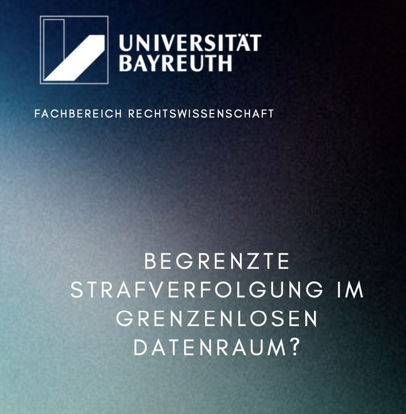

<section class="upcoming-event" aria-labelledby="crypto-crime-2026-title">
  
UPCOMING EVENT

  <figure class="upcoming-event__poster">
    
  </figure>

  

    <h2 id="crypto-crime-2026-title" class="upcoming-event__title">
      3rd Bayreuther IT-Strafrechtstag:
      “Crypto Crime – Auf der Spur des digitalen Geldes”
    </h2>

    <dl class="upcoming-event__details">
      

        <dt>Date</dt>
        <dd><time datetime="2026-10-08">8 October 2026</time></dd>
      

      

        <dt>Time</dt>
        <dd>Arrival from <time datetime="2026-10-08T09:30">09:30</time>; programme until <time datetime="2026-10-08T18:15">18:15</time></dd>
      

      

        <dt>Location</dt>
        <dd>University of Bayreuth, FZA Conference Room</dd>
      

      

        <dt>Registration</dt>
        <dd>Free of charge; deadline <time datetime="2026-09-25">25 September 2026</time></dd>
      

    </dl>

    

      
On 8 October 2026, the Chair of Criminal Law, Criminal Procedure and IT Criminal Law at the University of Bayreuth will host the third Bayreuther IT-Strafrechtstag under the theme “Crypto Crime – Auf der Spur des digitalen Geldes.”

      
Five interdisciplinary talks will bring together experts from law enforcement, legal practice, compliance, academia and cryptoasset forensics.

      
The programme addresses current challenges in tracing cryptocurrency transactions, the use and reliability of blockchain analysis tools, and the potential role of artificial intelligence in criminal investigations.

      
Further topics include anti-money-laundering compliance, the criminal-law treatment of crypto theft, and criminal activity involving DeFi platforms.

      
One of the talks focuses on the development of crypto forensics from heuristic clustering to agentic AI. This topic closely aligns with FAIRLEA’s research on cryptoasset forensics and the use of AI-supported tools in criminal investigations.

    

    

      <a
        class="btn btn--primary"
        href="https://www.strafrecht2.uni-bayreuth.de/de/Bayreuther-IT-Strafrechtstag/index.php"
        target="_blank"
        rel="noopener noreferrer"
      >Further information and registration</a>
      <a
        class="upcoming-event__secondary-link"
        href="https://www.strafrecht2.uni-bayreuth.de/pool/dokumente/Tagungsflyer-2026-_Digital_.pdf"
        target="_blank"
        rel="noopener noreferrer"
      >Download programme flyer</a>
    

  

</section>

### Second Project Meeting  
**Date:** 17–18 June 2026  
**Location:** Generalstaatsanwaltschaft Bamberg, Zentralstelle Cybercrime Bayern

  

  

### First Project Meeting  
**Date:** 02–03 December 2025  
**Location:** Complexity Science Hub Vienna, Iknaio

  

  

### Kick-Off Event  
**Date:** 23–24 July 2025  
**Location:** University of Bayreuth

<!--

<table style="width: 100%; border-spacing: 20px;">
  <tr>
    <td style="width: 200px; vertical-align: top;">
      
    </td>
    <td style="vertical-align: top;">
      <h3 style="margin-top: 0;">Bayreuther IT-Strafrechtstag 2025</h3>
      
<strong>Date:</strong> October 09, 2025 
         <strong>Time:</strong> 9:30 AM – 6:15 PM 
         <strong>Location:</strong> Universität Bayreuth, Kongressraum des
        Forschungszentrums Gesellschaft,
        Technik und Ökologie in Afrika
        (FZA)

      
Join experts from practice, academia, and government at the Bayreuth IT Criminal Law Day to discuss key challenges in cross-border law enforcement in the digital age. This year’s theme, “Limited Law Enforcement in a Borderless Data Space?”, will cover the EU e-Evidence Regulation, the UN Cybercrime Convention, and digital evidence from encrypted services. Don’t miss this crucial conversation on the future of global cooperation in criminal law enforcement.

      <a href="https://www.strafrecht2.uni-bayreuth.de/de/Bayreuther-IT-Strafrechtstag/index.php" target="_blank" style="display: inline-block; background-color: #007acc; color: white; padding: 5px 8px; border-radius: 5px; text-decoration: none;">
        📩 Register Now
      </a>
    </td>
  </tr>
</table>
-->

