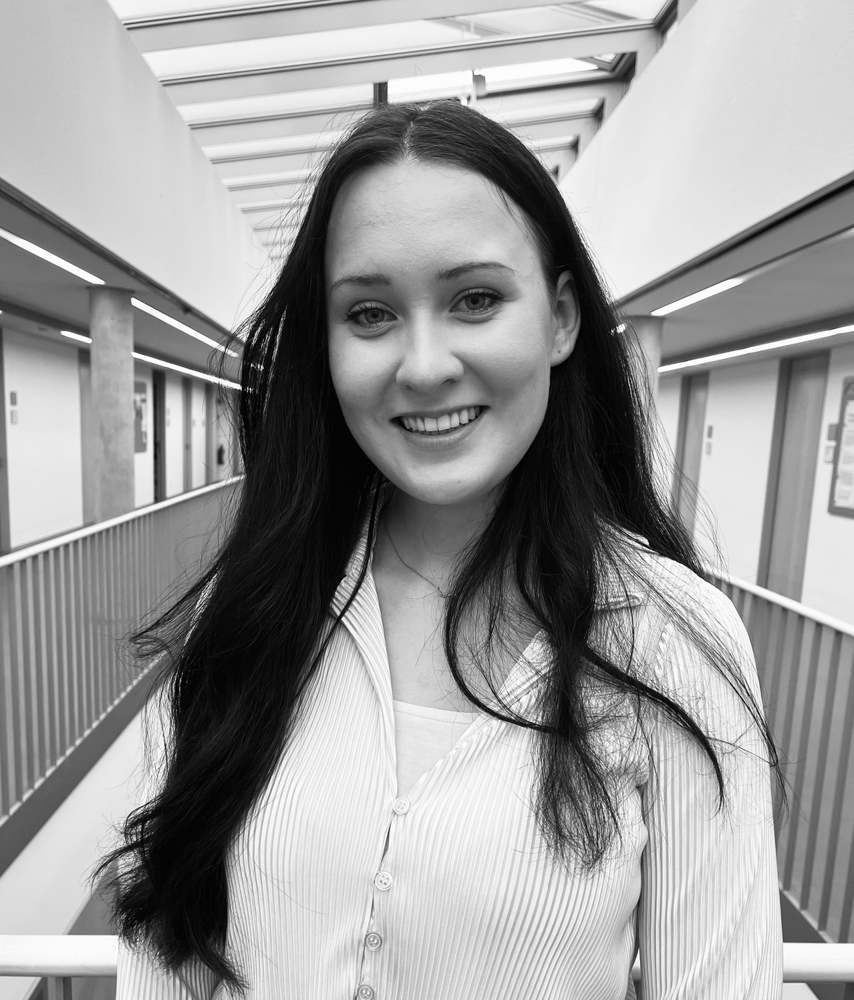
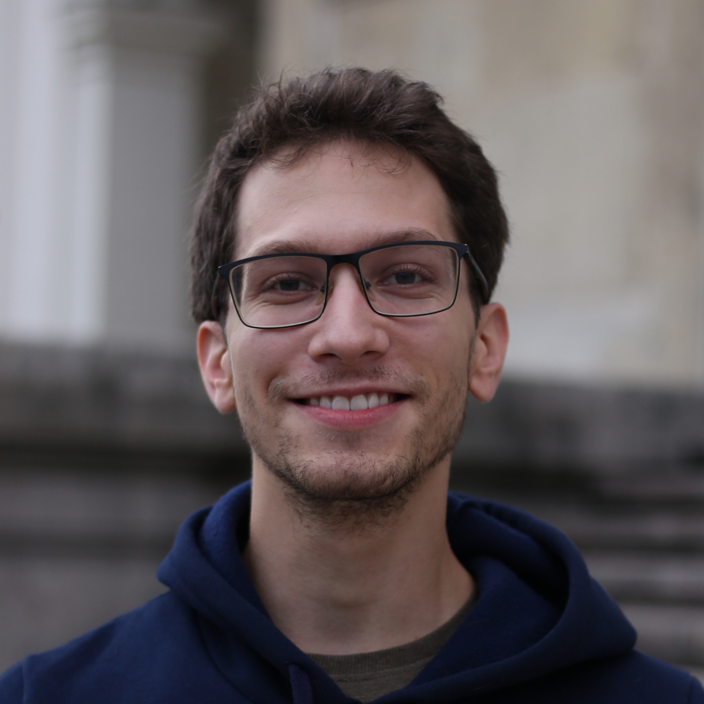
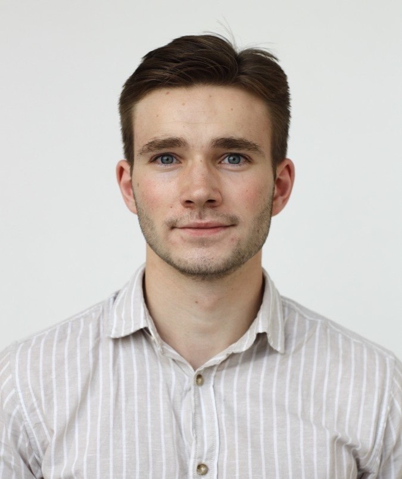

<table>
  <tr>
    <td style="vertical-align: top; width: 150px;">
      
    </td>
    <td style="vertical-align: top; padding-left: 20px;">
      
<strong>Prof. Dr. Christian Rückert</strong>

      
Christian Rückert is one of the leading legal experts on both the use of AI
      for law enforcement and the fight against crypotasset-related crime. He has presented on
      both research areas at high-level conferences and published in top-tier journals, legal
      practice handbooks, and commentaries. He has also advised the German Federal
      Government and the Bundestag on issues relating to cybercrime.

      <a href="mailto:lehrstuhl.str2[at]uni-bayreuth.de" style="text-decoration: none; margin-right: 10px;">
        📧 Email
      </a>
      <a href="https://linkedin.com/in/christian-rückert-296122189" target="_blank" style="text-decoration: none;">
        🔗 LinkedIn
      </a>
    </td>
  </tr>
  
  <tr>
    <td style="vertical-align: top; width: 150px;">
      
    </td>
    <td style="vertical-align: top; padding-left: 20px;">
      
<strong>Prof Dr. Niklas Kühl</strong>

      
Niklas Kühl is a full professor of information systems and human-centric AI at the University of Bayreuth, with roles at Fraunhofer FIT, FIM Research Institute, and IBM. His research spans machine learning, human-AI collaboration, fairness, and appropriate reliance. Previously, he led AI projects at IBM and earned his PhD (information systems) and habilitation (applied computer science) at the Karlsruhe Institute of Technology. He has published over 130 peer-reviewed articles and collaborates with global institutions like CMU, UT Austin, and MIT-IBM Watson AI Lab.

      <a href="mailto:kuehl@uni-bayreuth.de" style="text-decoration: none; margin-right: 10px;">
        📧 Email
      </a>
      <a href="https://linkedin.com/in/niklaskuehl" target="_blank" style="text-decoration: none;">
        🔗 LinkedIn
      </a>
    </td>
  </tr>
  
  <tr>
    <td style="vertical-align: top; width: 150px;">
      
    </td>
    <td style="vertical-align: top; padding-left: 20px;">
      
<strong>Dr. Bernhard Haslhofer</strong>

      
Bernhard Haslhofer is a faculty member and the leader of the Digital Currency Ecosystems research group at the Complexity Science Hub.
      His general research interest lies in developing and applying data science methods to extract insights from large-scale and interconnected datasets. Currently, he mostly focuses on analyzing cryptoasset and decentralized finance ecosystems.
      Previously, he was a thematic coordinator in the Data Science & Artificial Intelligence research group at the Austrian Institute of Technology (AIT), a Marie Curie fellow at Cornell Information Science, and an assistant professor at the University of Vienna. He received his doctorate in Computer Science from the University of Vienna and his M.S. in Economics and Computer Science from the Technical University of Vienna.
      Bernhard frequently collaborates in multidisciplinary settings and has published over 60 scientific articles in journals and conferences. He also contributed to international standardization efforts and has led many basic and applied research projects.

      <a href="mailto:haslhofer@csh.ac.at" style="text-decoration: none; margin-right: 10px;">
        📧 Email
      </a>
      <a href="https://linkedin.com/in/bernhardhaslhofer" target="_blank" style="text-decoration: none;">
        🔗 LinkedIn
      </a>
    </td>
  </tr>
  
  <tr>
    <td style="vertical-align: top; width: 150px;">
      
    </td>
    <td style="vertical-align: top; padding-left: 20px;">
      
<strong>Thomas Goger</strong>

      
Thomas Goger is Chief Public Prosecutor and Deputy Director of the Bavarian Central Office for the Prosecution of Cybercrime since it has been established in 2015. This office with currently 30 prosecutors and several IT specialists supporting them is one of the largest dedicated units in Europe for the prosecution of high-profile cyber cases. Thomas Goger has worked as a local prosecutor and district judge earlier in his career. He has been called upon as adviser to ministries and parliament on various cybercrime related topics. In 2016, he was seconded to the INTERPOL Global Complex for Innovation in Singapore for a few months. He has appeared as a speaker at and facilitator of various international events ever since. He is author of various articles in law journals on asset recovery regarding cryptocurrencies, on CSAM investigations and on MLAT reform. He has been a presenter at national and international conferences in Germany, Australia, France, Singapore, India, Croatia, Montenegro and the Philippines. He also is associated scientist with the research training group "Cybercrime & Forensic Computing" at the Friedrich-Alexander-University Erlangen-Nuremberg.

      <a href="mailto:john@pressestelle@gensta-ba.bayern.de" style="text-decoration: none; margin-right: 10px;">
        📧 Email
      </a>
      <a href="https://linkedin.com/in/thomas-goger-134342353" target="_blank" style="text-decoration: none;">
        🔗 LinkedIn
      </a>
    </td>
  </tr>
  
  <tr>
    <td style="vertical-align: top; width: 150px;">
      
    </td>
    <td style="vertical-align: top; padding-left: 20px;">
      
<strong>Jana Elsner</strong>

      
Jana Elsner is a legal doctoral candidate and research associate specializing in criminal procedure law, with a focus on the use of artificial intelligence in criminal prosecution and law enforcement in the cryptocurrency sector.

      <a href="mailto:jana.elsner@uni-bayreuth.de" style="text-decoration: none; margin-right: 10px;">
        📧 Email
      </a>
      <a href="https://www.linkedin.com/in/jana-elsner-40a798382/" target="_blank" style="text-decoration: none;">
        🔗 LinkedIn
        </a>
    </td>
  </tr>
  
  <tr>
    <td style="vertical-align: top; width: 150px;">
        
    </td>
    <td style="vertical-align: top; padding-left: 20px;">
        
<strong>Leopold Müller</strong>

        
Leopold Müller is a researcher at the Branch Business & Information Systems Engineering of the Fraunhofer FIT and a PhD candidate at the University of Bayreuth at the Chair of Information Systems and Human-Centric AI. In his research, he focuses on developing LLM solutions for real-world applications and AI-based decision support systems in minimal invasive surgeries.

        <a href="mailto:leopold.mueller@uni-bayreuth.de" style="text-decoration: none; margin-right: 10px;">
        📧 Email
        </a>
        <a href="https://linkedin.com/in/leopoldmueller" target="_blank" style="text-decoration: none;">
        🔗 LinkedIn
        </a>
    </td>
  </tr>
  
  <tr>
    <td style="vertical-align: top; width: 150px;">
      
    </td>
    <td style="vertical-align: top; padding-left: 20px;">
      
<strong>Thomas Niedermayer</strong>

      
Thomas Niedermayer is a data engineer at Iknaio Cryptoasset Analytics specializing in crypto data processing and investigative analytics. He works on developing Graphsense, an open source cryptoasset analytics software and creates crypto analytics solutions to combat crime at scale. Thomas holds a Master's degree in data science from Vienna University of Technology and a Bachelor's in mathematics from the University of Vienna.

      <a href="mailto:thomas.niedermayer@iknaio.io" style="text-decoration: none; margin-right: 10px;">
        📧 Email
      </a>
      <a href="https://linkedin.com/in/thomas-niedermayer" target="_blank" style="text-decoration: none;">
        🔗 LinkedIn
      </a>
    </td>
  </tr>
  <tr>
    <td style="vertical-align: top; width: 150px;">
      
    </td>
    <td style="vertical-align: top; padding-left: 20px;">
      
<strong>Simon Lobinger</strong>

      
Simon Lobinger is a student research assistant at the Chair of Criminal Law, Criminal Procedure and IT Criminal Law (Prof. Dr. Christian Rückert) with a special interest in the law of digitization and the digitization of law.

      <a href="mailto:simon.lobinger@uni-bayreuth.de" style="text-decoration: none; margin-right: 10px;">
        📧 Email
      </a>
      <a href="https://linkedin.com/in/simon-lobinger-87108926b" target="_blank" style="text-decoration: none;">
        🔗 LinkedIn
      </a>
    </td>
  </tr>
  <tr>
    <td style="vertical-align: top; width: 150px;">
      
    </td>
    <td style="vertical-align: top; padding-left: 20px;">
      
<strong>Sophia Schütz</strong>

      
Sophia Schütz is a student research assistant at the Chair of Criminal Law, Criminal Procedure and IT Criminal Law of Prof. Dr. Christian Rückert at the University of Bayreuth with a special interest in the use of AI for law enforcement.

      <a href="mailto:sophia.schuetz@uni-bayreuth.de" style="text-decoration: none; margin-right: 10px;">
        📧 Email
      </a>
    </td>
  </tr>
  <tr>
    <td style="vertical-align: top; width: 150px;">
      
    </td>
    <td style="vertical-align: top; padding-left: 20px;">
      
<strong>Arian Javaheri</strong>

      
Arian Javaheri is a student research assistant at Fraunhofer FIT and a computer science student at the University of Bayreuth. He develops LLM-based AI agents to enhance business processes in platform and innovation management and supports AI-driven automation projects at Siemens Healthineers.

      <a href="mailto:arian.javaheri@uni-bayreuth.de" style="text-decoration: none; margin-right: 10px;">
        📧 Email
      </a>
    </td>
  </tr>
  <tr>
    <td style="vertical-align: top; width: 150px;">
      
    </td>
    <td style="vertical-align: top; padding-left: 20px;">
      
<strong>Marie Kufner</strong>

      
Marie Kufner is a student research assistant at the Branch Business & Information Systems Engineering of Fraunhofer FIT and at the Chair of Digital Management at the University of Hohenheim with a particular interest in AI, its diverse areas of application, and its responsible use.

      <a href="mailto:marie.kufner@uni-hohenheim.de" style="text-decoration: none; margin-right: 10px;">
        📧 Email
      </a>
      <a href="https://www.linkedin.com/in/marie-kufner" target="_blank" style="text-decoration: none;">
        🔗 LinkedIn
      </a>
    </td>
  </tr>
</table>